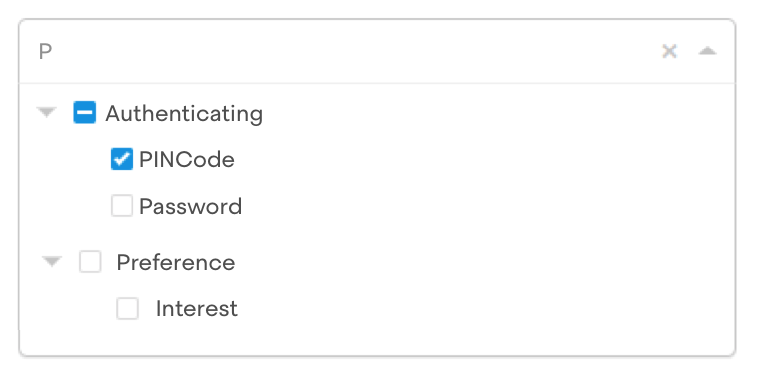

# The problem

One of the challenges Metomic helps companies with is to classify personal data. We'd like to help different companies classify similar data in the same way.

To this end, we've taken inspiration from [this schema](https://www.w3.org/ns/dpv), and are offering an auto-complete style experience that will help a company enter the categories of data that they process.

# The context

The data from the DPV is hierchical - any category can have children. E.g. `Password` is a (very small) category of data that lives under the `Authenticating` category, which in turn lives under the `Internal` category.

We've pre-processed the schema file from the DPV into a list of comma-separated pairs (see `pairs.csv`) that represent parent-child relationships:

```
...
Internal , Authenticating
Authenticating , PINCode
Authenticating , Password
Authenticating , Secret Text
Internal , Preference
Preference , Interest
...
```

We've also prepared a visualisation of the data over here, which might aid understanding: https://affectionate-leakey-675a75.netlify.app/#opts=doc=0; (try searching for "Password")


# Your mission
(should you choose to accept it)

Our front-end developer wants to create an auto-complete experience that allows the user to search and select a category at any level. Here's the intended design:



On each keystroke in the input field, the front-end will request the results to be displayed in the auto-complete box.

**Your goal is to create an endpoint that can power the search for this.**

How you do this is completely up to you. By way of example, a reasonable working solution might look something like:

```
> curl http://localhost:8080/search/data-categories?q=P
{
  "searchTerm": "P",
  "results": ...
}
```

## Things to be aware of
- The format of the response you send is up to you (the front-end has not been built yet). You should aim to return the data in a format that the front-end dev can make use of easily
- We don't expect heavy traffic to this API - current estimates cap at 1000 customers concurrently searching.
- You should timebox this solution to a **MAXIMUM of 2 hours**. (A production-ready enterprise-grade cloud-deployed system is cool and all, we should be paying you for that :] )
- This spec is vague, but the end result should be clear. You'll need to make some reasonable assumptions along the way.


## Things we're looking for
- The approach you take to solving the problem. What's important, what's not?
- Code structure. Can other people work in your codebase?
- The obvious one: does it work? :)

# One more thing...

There's no sample code in this project. If we've agreed a technology upfront, you know what to do. If not, the language / libraries you choose are completely up to you.